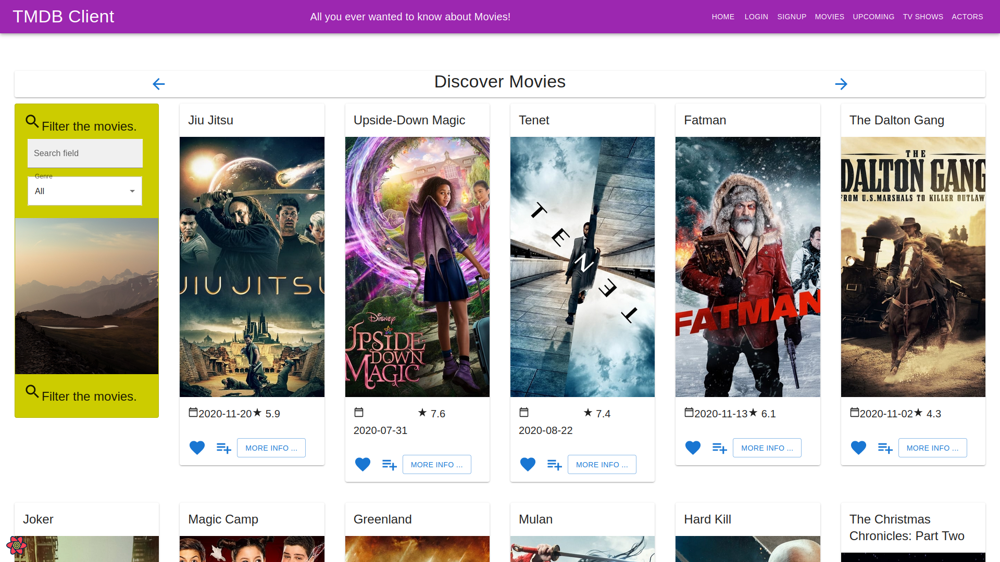
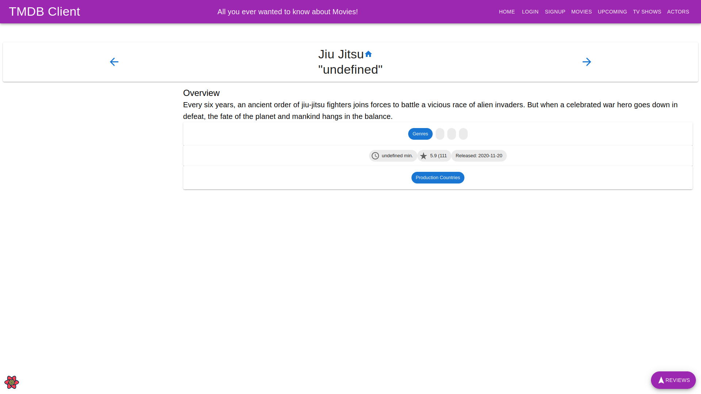
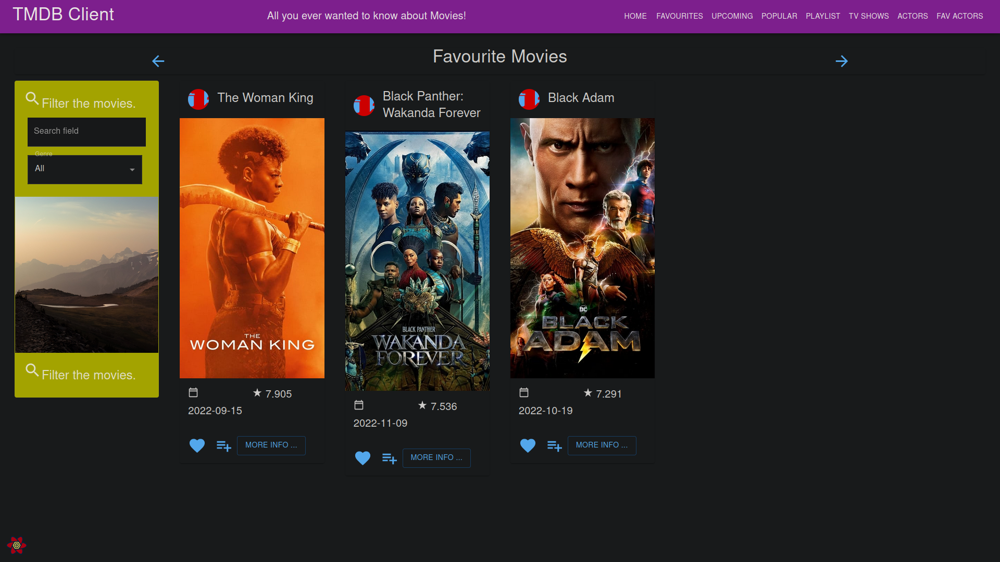
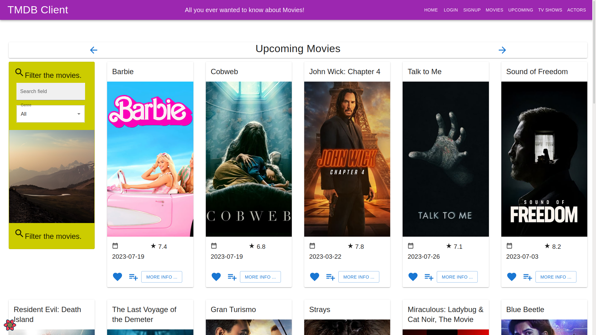
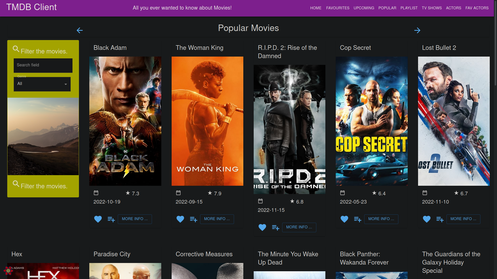
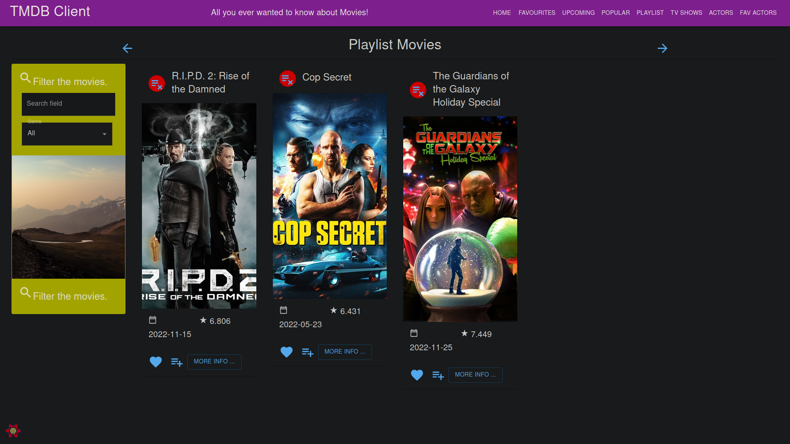
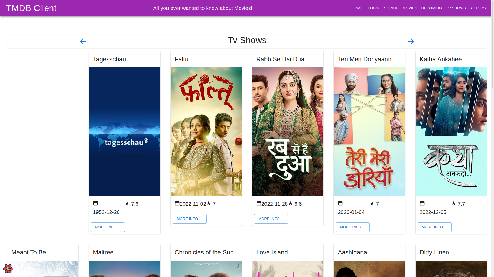
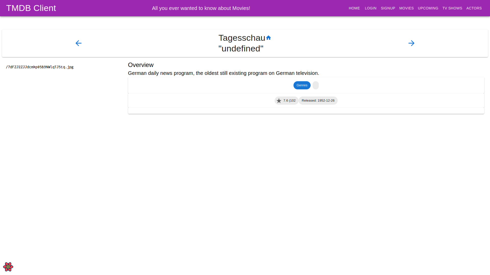
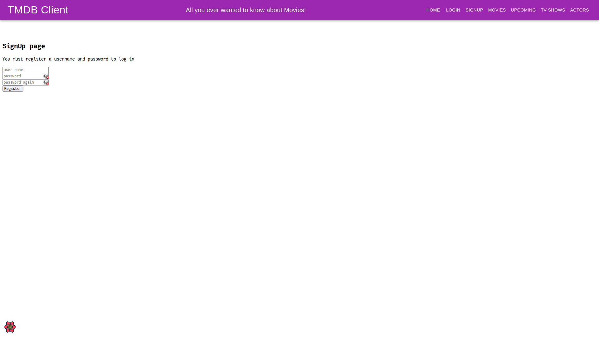

# Movies App

​
Name: Keith Butler

Student Number: 20089137

## Description

A react app that used the [Movies-Api](https://github.com/KeithButler-WIT/movies-api) to work.

## Visuals

### Home Page



### Home Page



<!-- ### Favourite Movies Page -->

<!--  -->

### Upcoming Movies Page



<!-- ### Popular Movies Page -->

<!--  -->

<!-- ### Movies Playlist Page -->

<!--  -->

### Popular Tv Shows Page



### Tv Shows Details Page



### Actors Page


<!-- ### Favourite Actors Page -->

<!--  -->

### Login Page


### Signup Page



## Usage

To install the dependencies use the command:

```sh
npm install
```

To start the development server run the following command from inside the project directory:

```sh
npm start
```

To run the storybook of the project use:

```sh
npm run storybook
```
